# StreamElements Dog-Themed Custom Widgets

This repository contains custom widgets for StreamElements, formatted and structured directly for copy-pasting into StreamElements overlays.

---

## How to Install in StreamElements
1. Go to your **StreamElements Dashboard** and navigate to **Streaming Tools** -> **Overlays**.
2. Click **Create New Overlay** (or edit an existing one).
3. Click the **+** (Add Widget) icon in the bottom-left, select **Static/Custom** -> **Custom Widget**.
4. Click on the new widget, open the **Settings** menu on the left side, and click **Open Editor**.
5. Copy the contents of the four files (`widget.html`, `widget.css`, `widget.js`, `widget.json`) from the respective widget directory and paste them into their tabs in the StreamElements code editor.
6. Click **Done** and then **Save** the overlay!
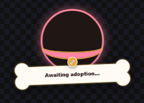
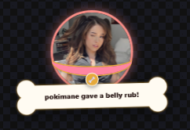
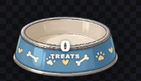
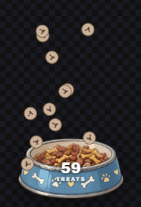
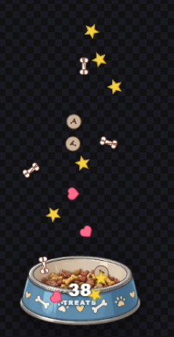
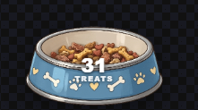
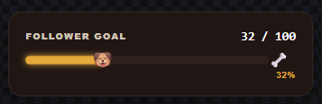
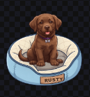
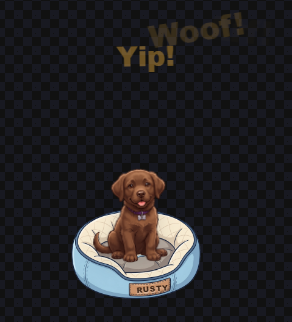
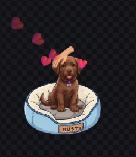
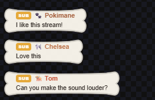
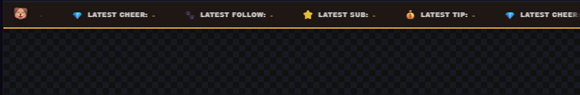
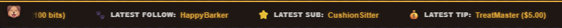

All widgets are animated and tested in Streamelements. 

**Features & Included Overlays**
- **Bark-alert**: Custom animated popups for new followers, subscribers, donations, and cheers.
- **Event-ticker**: A minimalist, scrolling tracker showing latest follow, latest sub, latest tip and latest cheer.
- **Pup-chat**: A chat overlay with badge support and smooth fade-out animations.
- **Pup-goal**: Dynamic progress bar tracking the follower milestone.
- **Stream-pet**: The pet celebrates a new follower, subscriber or cheer. Viewers can feed it, pet it, or let it bark using custom chat commands.
- **Treat-counter**: Every follower, subscriber and cheer alert drops treats directly into a visual counter dog bowl.

**Customization**

Once the `fields.json` code is pasted into the Fields tab, you can customize the overlays directly from the StreamElements sidebar menu without touching the code:
- Change primary and secondary accent colors
- Adjust text font sizes and display durations
- Set custom messages